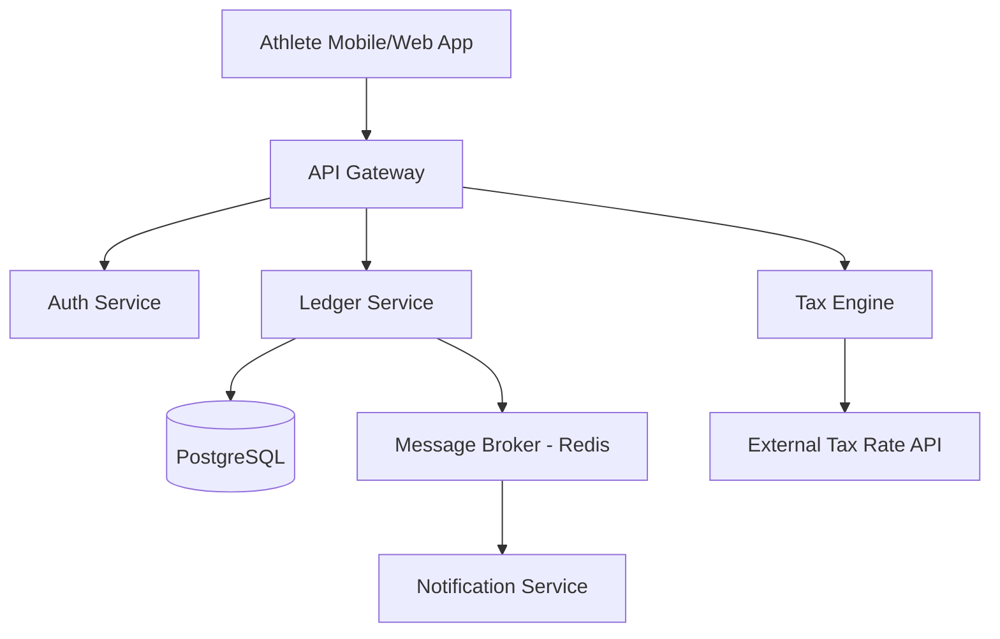

# Tax Ledger for NIL athletes System Design

# Design Document: Tax Ledger for NIL Athletes

**Status:** Draft | **Author:** Distinguished Engineer | **Date:** 2023-10-27

---

## 1. Executive Summary
The Name, Image, and Likeness (NIL) landscape has created a complex financial environment for student-athletes who are essentially operating as small businesses. This system provides a **double-entry accounting ledger** designed for high integrity, auditability, and real-time tax liability estimation. 

The technical approach prioritizes **immutability** (ledger entries cannot be deleted), **accuracy** (decimal-precision math), and **compliance** (automated tax withholding calculations based on multi-state jurisdictions). We will utilize an event-driven architecture to ensure that every payout triggers an immediate tax obligation calculation.

---

## 2. Technology Stack

| Component | Technology | Justification |
| :--- | :--- | :--- |
| **Language** | Go (Golang) | Strong concurrency support, high performance, and type safety for financial logic. |
| **Primary Database** | PostgreSQL | ACID compliance is non-negotiable for a financial ledger. Support for `NUMERIC` types to avoid floating-point errors. |
| **Cache/Queue** | Redis | For session management and as a message broker for asynchronous tax calculation jobs. |
| **Cloud Provider** | AWS | Global reach with specialized services like AWS KMS for encrypting sensitive tax IDs (SSNs). |
| **Frontend** | React + TypeScript | Robust ecosystem for complex data visualization and state management. |
| **Infrastructure** | Terraform + Kubernetes (EKS) | Infrastructure as code and container orchestration for seamless scaling. |

---

## 3. System Architecture

### High-Level Component Diagram
The system follows a microservices-lite approach to balance simplicity with scalability.



1.  **Ledger Service**: The source of truth for all transactions (Income, Payouts, Adjustments).
2.  **Tax Engine**: Calculates estimated federal and state withholdings based on the athlete's home state and the state where the income was earned (Jock Tax logic).
3.  **Auth Service**: Handles OAuth2/OpenID Connect and manages sensitive PII (Personally Identifiable Information).

---

## 4. Database Schema

We utilize a **double-entry** inspired schema. Every "Transaction" has at least two "Entries" to ensure the ledger always balances.

### Table: `athletes`
| Column | Type | Description |
| :--- | :--- | :--- |
| `id` | UUID (PK) | Unique identifier |
| `tax_id_enc` | BYTEA | Encrypted SSN/TIN |
| `home_state` | VARCHAR(2) | Primary residence for tax purposes |

### Table: `transactions`
| Column | Type | Description |
| :--- | :--- | :--- |
| `id` | UUID (PK) | Unique identifier |
| `athlete_id` | UUID (FK) | Reference to athlete |
| `type` | ENUM | INCOME, PAYOUT, TAX_WITHHOLDING |
| `amount` | NUMERIC(19,4) | Total transaction amount |
| `currency` | VARCHAR(3) | USD |
| `status` | ENUM | PENDING, COMPLETED, FAILED |
| `created_at` | TIMESTAMP | Audit timestamp |

### Table: `ledger_entries`
| Column | Type | Description |
| :--- | :--- | :--- |
| `id` | UUID (PK) | Unique identifier |
| `transaction_id` | UUID (FK) | Reference to parent transaction |
| `account_type` | ENUM | ASSET, LIABILITY, EQUITY, REVENUE, EXPENSE |
| `direction` | ENUM | DEBIT, CREDIT |
| `amount` | NUMERIC(19,4) | Entry value |

---

## 5. API Specification

### `POST /v1/transactions`
Records a new NIL income event.
- **Request Body**:
```json
{
  "athlete_id": "uuid",
  "source": "Brand X Sponsorship",
  "gross_amount": 10000.00,
  "state_of_earning": "CA",
  "category": "Social_Media_Post"
}
```
- **Response**: `201 Created` with calculated `estimated_tax`.

### `GET /v1/ledger/summary`
Returns the current financial standing.
- **Query Params**: `athlete_id`, `tax_year`
- **Response**:
```json
{
  "total_net_income": 45000.00,
  "total_tax_withheld": 12000.00,
  "estimated_tax_due": 3000.00,
  "liquidity": 33000.00
}
```

---

## 6. UI Component Breakdown

### Dashboard Hierarchy
- **`Layout`**: Navigation, User Profile, Global Balance Toggle.
    - **`StatGrid`**:
        - `BalanceCard`: Real-time net-of-tax cash.
        - `TaxLiabilityCard`: Real-time estimated debt to IRS/States.
    - **`TransactionList`**:
        - `TransactionRow`: Clickable item showing gross vs. net.
        - `FilterBar`: Filter by date range or income source.
    - **`TaxDocumentCenter`**:
        - `W9Generator`: Dynamic PDF creation.
        - `Form1099Uploader`: Upload and OCR processing of tax forms.

---

## 7. Data Flow: Income & Tax Calculation

1.  **Ingestion**: An athlete records a $5,000 deal from a brand.
2.  **Validation**: Ledger service validates the schema and idempotency key.
3.  **Persistence**: The transaction is written to the `transactions` table with a `PENDING` status.
4.  **Tax Trigger**: An event is published to Redis.
5.  **Tax Calculation**: The Tax Engine consumes the event, looks up the athlete's YTD earnings and the nexus (state) of the deal, and calculates:
    - Self-Employment Tax (15.3%)
    - Federal Income Tax (based on projected bracket)
    - State Income Tax
6.  **Ledger Update**: The Ledger Service creates `ledger_entries` representing the "Tax Liability" and updates the transaction status to `COMPLETED`.

---

## 8. Security & Scalability

### Security
- **PII Encryption**: Tax IDs are encrypted at the application layer using AES-256 before hitting the database. Decryption keys are managed via AWS KMS with strict IAM roles.
- **Audit Logging**: Every change to a transaction creates an entry in a `shadow_audit_table` that is append-only.
- **SOC2 Compliance Ready**: All API requests require JWT tokens with specific scopes (`ledger:read`, `ledger:write`).

### Scalability
- **Read Replicas**: Use Postgres read replicas for the dashboard's heavy analytical queries (YTD summaries).
- **Partitioning**: Partition the `ledger_entries` table by `created_at` (monthly or yearly) to maintain query performance as data grows into millions of rows.
- **Stateless Logic**: The Tax Engine is stateless, allowing it to scale horizontally during peak periods (e.g., end of quarter tax deadlines).